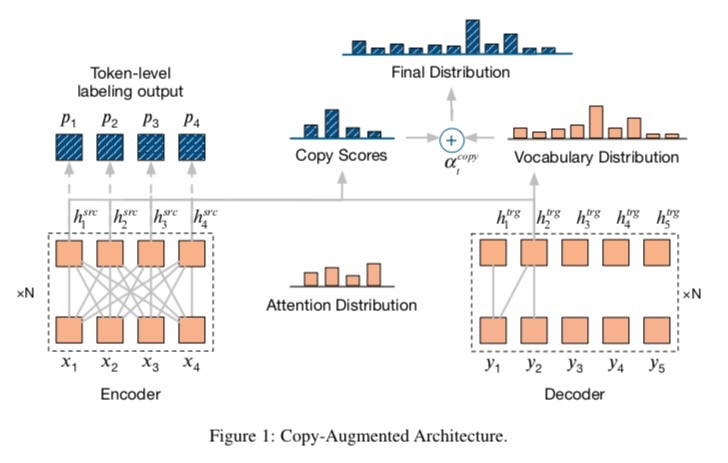

# Introduction

Source code for the paper: 
**Improving Grammatical Error Correction via Pre-Training a Copy-Augmented Architecture with Unlabeled Data**
Authors: Wei Zhao, Liang Wang, Kewei Shen, Ruoyu Jia, Jingming Liu
Arxiv url: https://arxiv.org/abs/1903.00138
Comments: Accepted by NAACL 2019 (oral)


## Dependecies
- PyTorch version >= 1.0.0
- Python version >= 3.6

## Downloads
- Download CoNLL-2014 evaluation scripts

```
cd gec_scripts/
sh download.sh
```

- Download **pre-processed data** & **pre-trained models**
 
> upload later

## Train with the pre-trained model
```
cd fairseq-gec
pip install --editable
sh train.sh \${device_id} \${experiment_name}
```

## Train without the pre-trained model
Modify train.sh to train without the pre-trained model

- delete parameter "--pretrained-model" 
- change the value of "--max-epoch" to 15 (more epochs are needed without pre-trained parameters) 

## Evaluate on the CoNLL-2014 test dataset
```
sh g.sh \${device_id} \${experiment_name}
```

## Get pre-trained models from scratch
We have public our pre-trained models as mentioned in the downloads part. We list the steps here, in case someone want to get the pre-trained models from scratch. 

```
1. # prepare target sentences using one billion benchmark dataset
2. sh noise.sh # generate the noised source sentences 
3. sh preprocess_noise_data.sh # preprocess data
4. sh pretrain.sh 0,1 _pretrain # pretrain 
```

## Acknowledgments
Our code was modified from [fairseq](https://github.com/pytorch/fairseq) codebase. We use the same license as fairseq(-py).


## Citation
Please cite as:

```
@article{zhao2019improving,
  title={Improving Grammatical Error Correction via Pre-Training a Copy-Augmented Architecture with Unlabeled Data},
    author={Zhao, Wei and Wang, Liang and Shen, Kewei and Jia, Ruoyu and Liu, Jingming},
      journal={arXiv preprint arXiv:1903.00138},
        year={2019}
}
```


